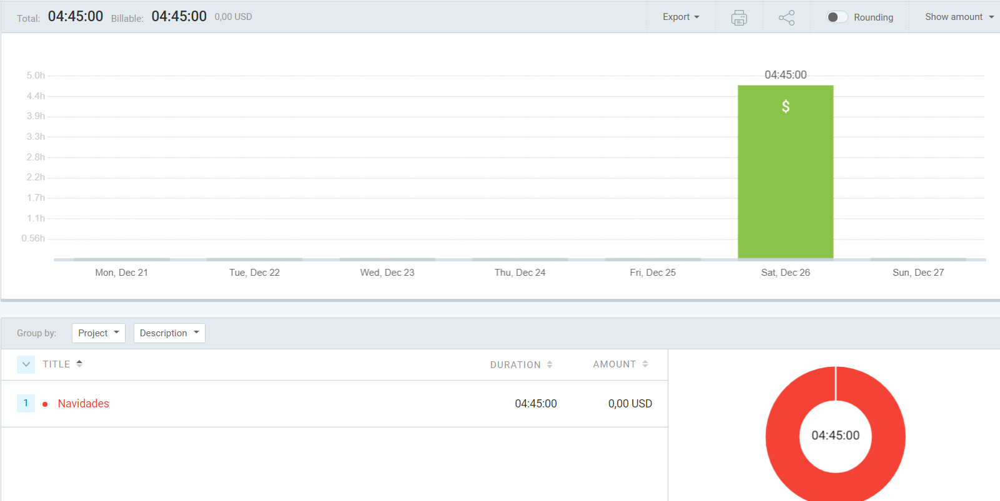

# Refactorizando Yatzy
### He refactorizado este código analizando los code smells y siguiendo los consejos del capítulo 24 (página 623) del libro Code Complete.
### He realizado esta kata en pareja, con Joan de Pong, a través de discord (no hemos utilizado Live Share, sino que cada uno su kata en su ordenador y si alguno se atascaba el otro ayudaba) y hemos tenido ayuda externa de Victor de Pong.
### Opinión personal de la experiencia realizando esta kata
### Me ha parecido muy interesante y una buena forma de practicar (sobretodo TDD), y una buena forma de iniciar la programación orientada a objetos, ya que al menos a mí personalmente me ha ayudado a entender como funcionan las clases.
# Tiempo empleado en dicha kata

